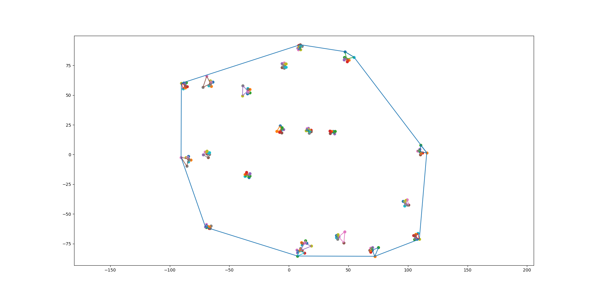
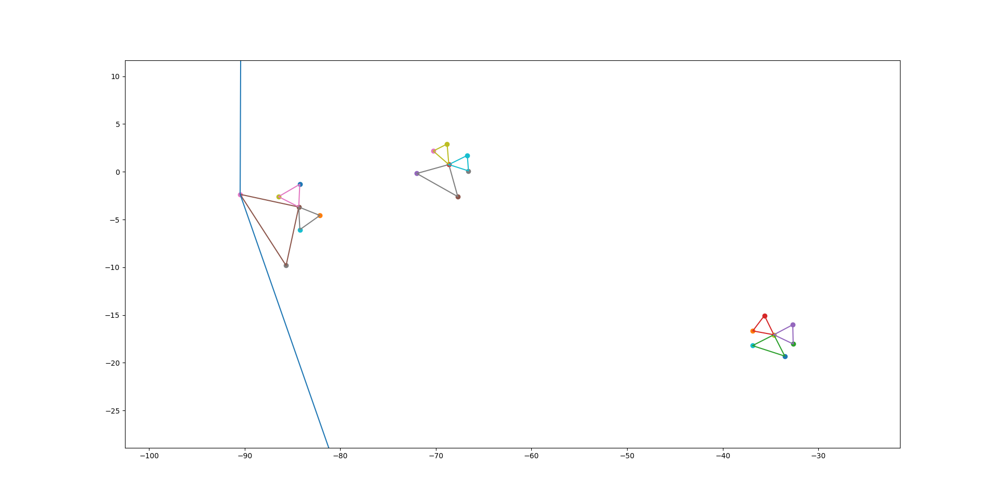

# Convex-Hull
Python script finding a convex hull around created shapes

## Overview
This script is designed to generate and visualize complex polygon shapes resembling tigers using Python libraries such as numpy and matplotlib. It defines a Tiger class to encapsulate the methods for generating and transforming the points that form the "tiger" polygons. The script performs the following key functions:

- Generates random points within a specified range to act as centers for tiger shapes.
- Creates points around each center to form the base of the tiger shapes.
- Generates tiger shapes by calculating and rotating points to form polygonal representations of tigers.
- Generates a convex hull around created tigers

## Examples

The script is highly customizable, allowing adjustments to the number of points, the radius of the circular base, and the range of the centers.
Due to the random nature of the generation, each execution will produce a unique set of tiger shapes. Below are some examples of the outcome:

